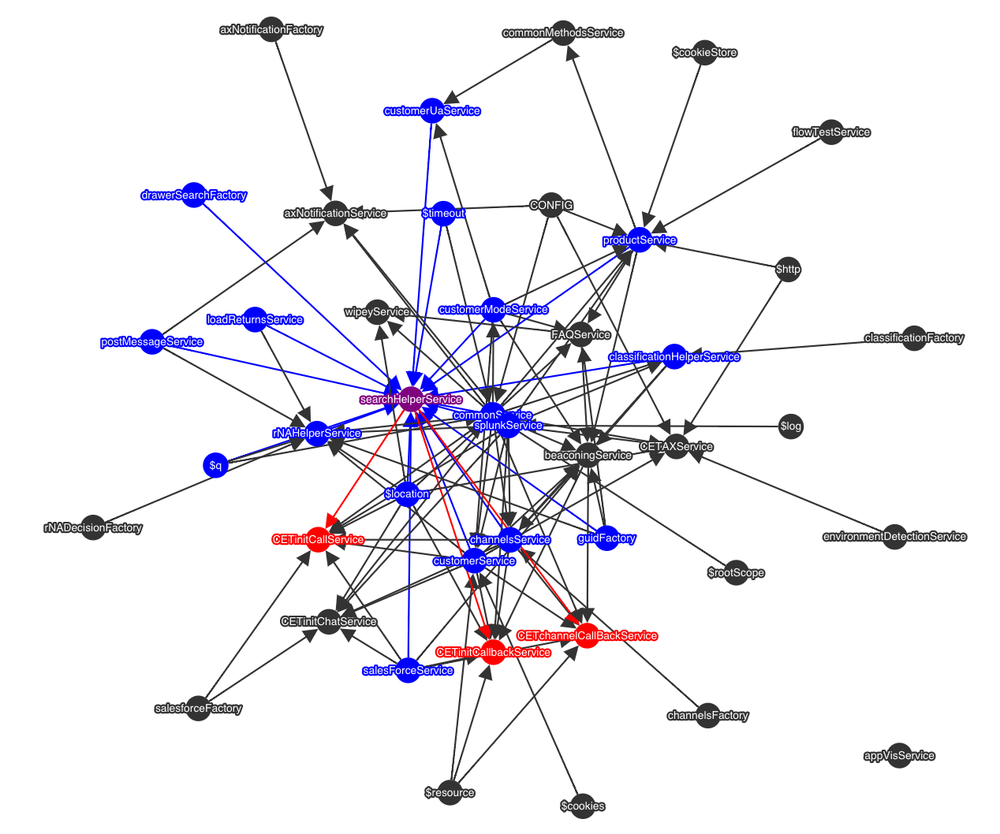

# AngularJS-Service-Dependency-Graph
Draws a directed graph of your app's AngularJS Services.

<i>Example of TurboTax's Help System</i>

To use:

1. Include the following HTML in a page/view that has access to your Angular application
	    
	    
	    

	    

		

2. Update "path/to/appVisService.js" to reflect the actual path of this file
3. Add your app's modules to the modules array in the appVisService.js file
4. Add the following to your angular .run() method

<code>
  app.run(['appVisService', function (appVisService) {
		  appVisService.init();
	  }
  ]);
</code>
